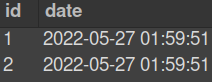

# Projeto Store Manager

## O que foi desenvolvido:

 Está API utiliza a arquitetura MSC (model-service-controller).

  * A API construída é um sistema de gerenciamento de vendas no formato dropshipping onde é possível criar, visualizar, deletar e atualizar produtos e vendas. Foi utilizado o banco de dados MySQL para a gestão de dados. Além disso, a API é RESTful.

  ## Diagrama de Entidade-Relacionamento

  

## Tabelas

 ### A tabela `products` tem o seguinte formato: *(O id será gerado automaticamente)*

  

 ### A tabela `sales` tem o seguinte formato: *(O id e date são gerados automaticamente)*

  


 ### A tabela `sales_products`, é a tabela que faz o relacionamento `N:N` entre `products` e `sales` e tem o seguinte formato: *(O produto e a venda são deletados automaticamente)*

  
  
---

## Para executar os testes de unidade:
  ```sh
    npm run test:mocha
  ```

 ## Tecnologias utilizadas:


